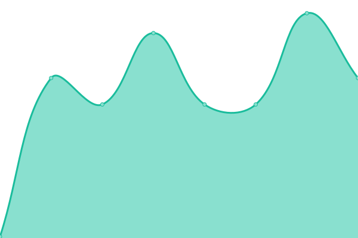
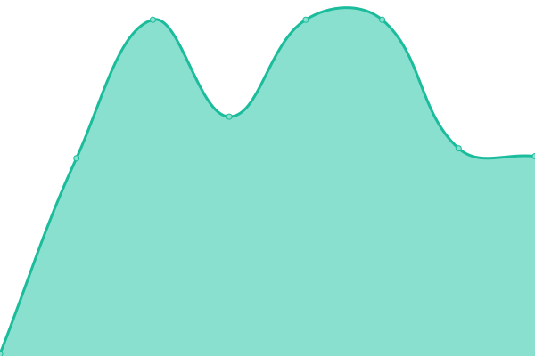

# [📈 Live Status](https://srdno.github.io/status): <!--live status--> **🟩 All systems operational**

This repository contains the open-source uptime monitor and status page for [Sander](srd.no), powered by [Upptime](https://github.com/upptime/upptime).

With [Upptime](https://upptime.js.org), you can get your own unlimited and free uptime monitor and status page, powered entirely by a GitHub repository. We use [Issues](https://github.com/srdno/status/issues) as incident reports, [Actions](https://github.com/srdno/status/actions) as uptime monitors, and [Pages](https://srdno.github.io/status) for the status page.

<!--start: status pages-->
<!-- This summary is generated by Upptime (https://github.com/upptime/upptime) -->
<!-- Do not edit this manually, your changes will be overwritten -->
<!-- prettier-ignore -->
| URL | Status | History | Response Time | Uptime |
| --- | ------ | ------- | ------------- | ------ |
|  [Balise](https://balise.no) | 🟩 Up | [balise.yml](https://github.com/srdno/status/commits/HEAD/history/balise.yml) | 

 724ms
     
 | 

<a href="https://status.srd.no/history/balise">100.00%</a>
    

|  [SRD](https://srd.no) | 🟩 Up | [srd.yml](https://github.com/srdno/status/commits/HEAD/history/srd.yml) | 

 567ms
     
 | 

<a href="https://status.srd.no/history/srd">100.00%</a>
    

|  [API](https://api.srd.no/status) | 🟩 Up | [api.yml](https://github.com/srdno/status/commits/HEAD/history/api.yml) | 

 525ms
     
 | 

<a href="https://status.srd.no/history/api">100.00%</a>
    

|  [TH1](th1.srd.no) | 🟩 Up | [th-1.yml](https://github.com/srdno/status/commits/HEAD/history/th-1.yml) | 

 145ms
     
 | 

<a href="https://status.srd.no/history/th-1">100.00%</a>
    

|  [TH2](th2.srd.no) | 🟩 Up | [th-2.yml](https://github.com/srdno/status/commits/HEAD/history/th-2.yml) | 

 147ms
     
 | 

<a href="https://status.srd.no/history/th-2">100.00%</a>
    

<!--end: status pages-->

[**Visit our status website →**](https://srdno.github.io/status)

## 📄 License

- Powered by: [Upptime](https://github.com/upptime/upptime)
- Code: [MIT](./LICENSE) © [Anand Chowdhary](https://anandchowdhary.com), supported by [Pabio](https://pabio.com)
- Data in the `./history` directory: [Open Database License](https://opendatacommons.org/licenses/odbl/1-0/)
